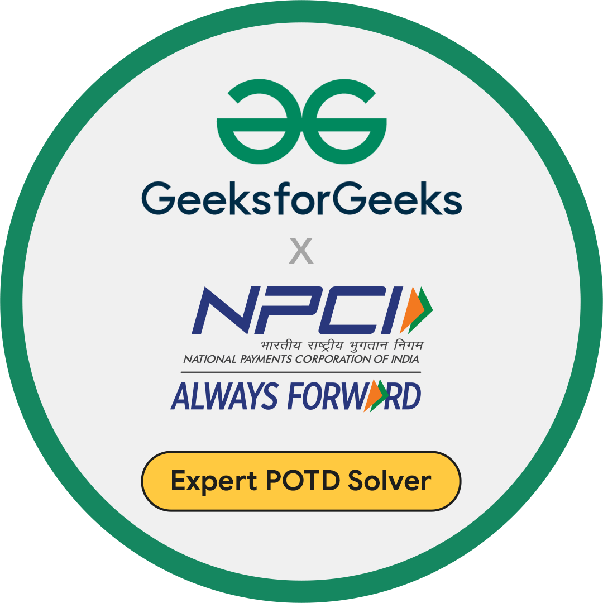

<h1 align="center">Hello,  I'm Nitesh K. Tiwari 🦊 !</h1>

 
  
  

  

- 🌱 I’m currently learning **Advanced SQL • Data Engineering Basics • ETL Concepts**
- 💬 Ask me about **backend development, SQL & database design, Python for backend logic, and system fundamentals**
- 📫  Open to collaborating on Artificial Intelligence, software development, and coding-based projects.
- ⚡ Fun fact: **I treat bugs like puzzles — the harder they are, the more fun it gets**

<h3 align="left">Languages and Tools:</h3>

  
   
  
   
  

 

  
  
  
  
  
  
  
  

## 🏆 Github Status

## 🚀 Competitive Programming

  
 

  

  

  
<strong>More Coding Practice Badges</strong>

   

  

  

## 🏅 Holopin Badges

  

  

### Show some ❤️ by starring ⭐ some of the repositories!

